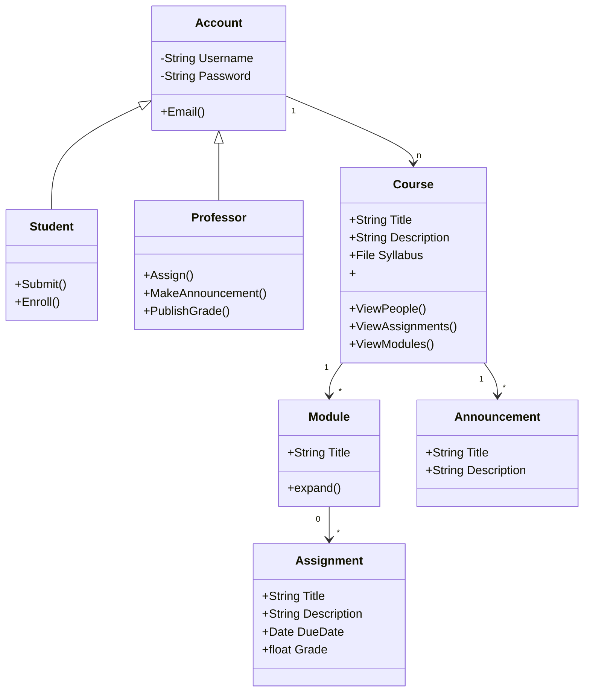

```mermaid
classDiagram

  Account <|-- Student
  Account <|-- Professor
  Account "1" --> "n" Course
  Course "1" --> "*" Module
  Course "1" --> "*" Announcement
  Module "0" --> "*" Assignment
  
  class Account{
    -String Username
    -String Password
    +Email()
  }

  class Student{
    +Submit()
    +Enroll()
  }

  class Professor{
    +Assign()
    +MakeAnnouncement()
    +PublishGrade()

  }

  class Course{
    +String Title
    +String Description
    +File Syllabus
    +
    +ViewPeople()
    +ViewAssignments()
    +ViewModules()
  }

  class Module{
    +String Title
    +expand()
  }

  class Announcement{
    +String Title
    +String Description
  }

  class Assignment{
    +String Title
    +String Description
    +Date DueDate
    +float Grade

  }

```